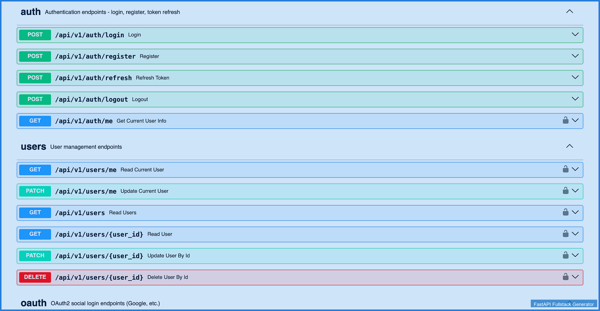
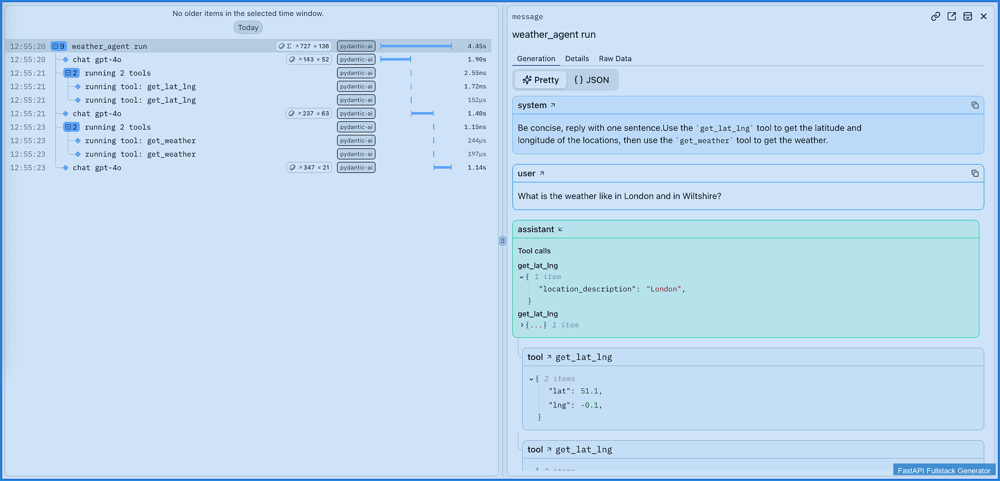
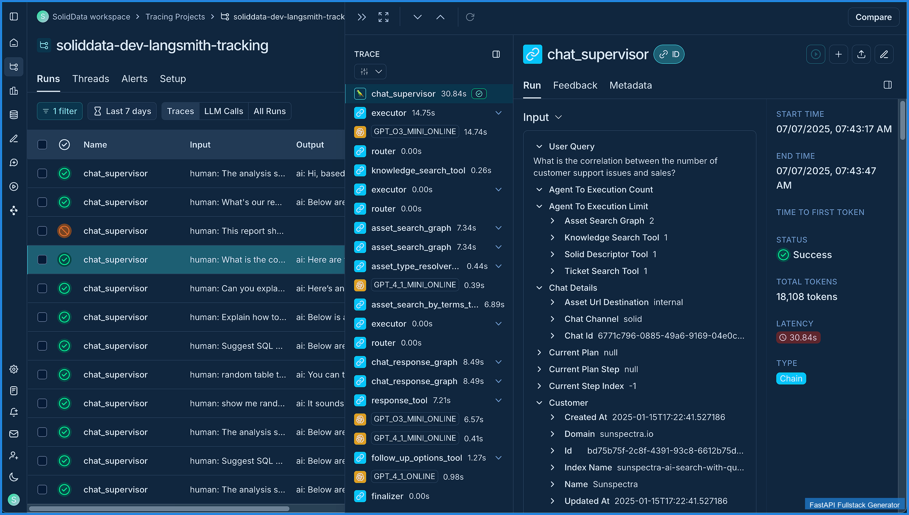
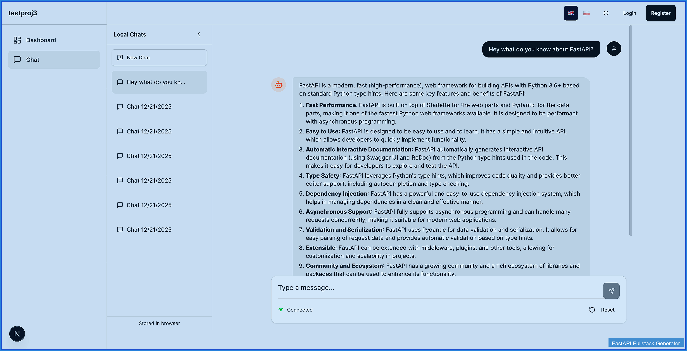
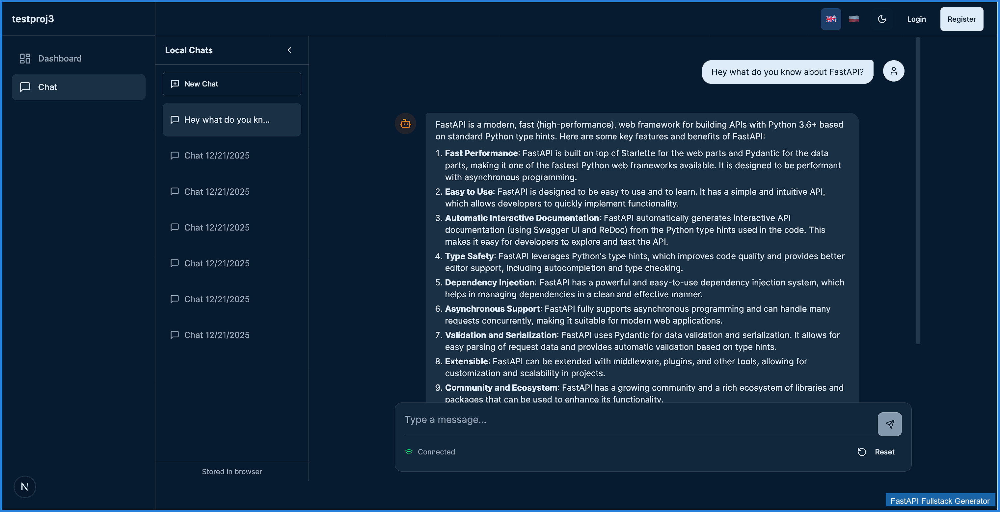
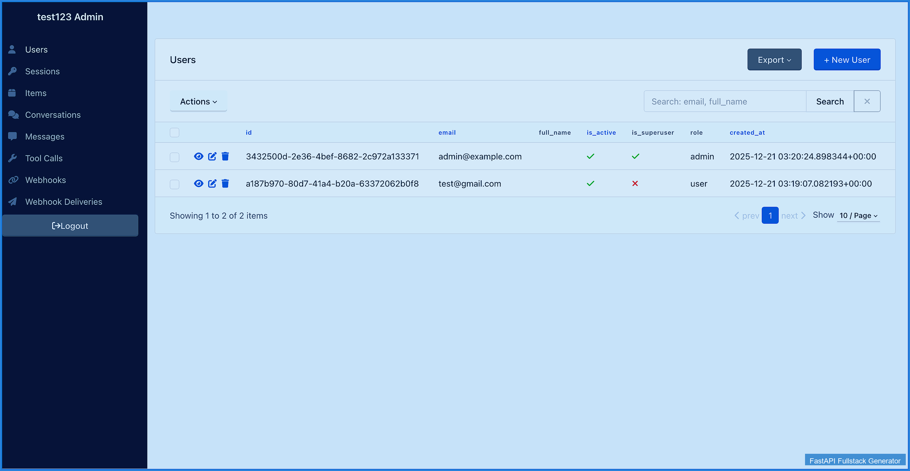
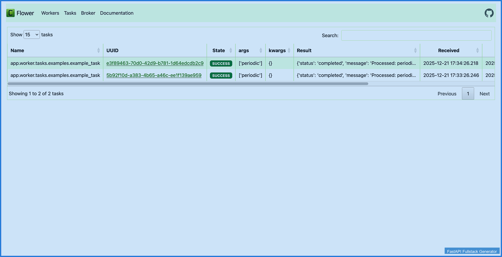
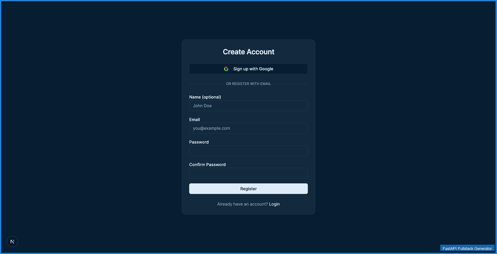
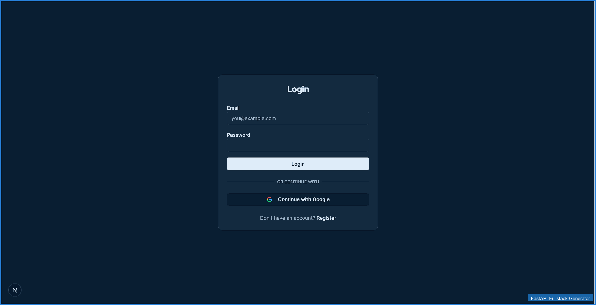
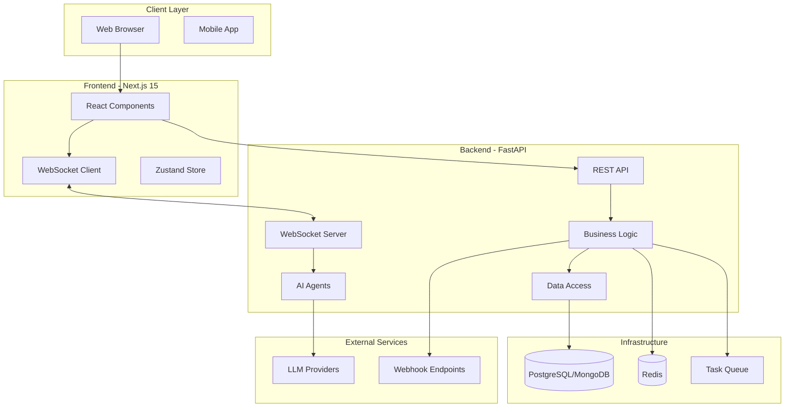

<div align="center">

# FastAPI Fullstack Generator

### Production-Ready FastAPI + Next.js Generator for AI Applications

[](https://github.com/AhmedRaoofuddin/Generator/stargazers)
[](https://github.com/AhmedRaoofuddin/Generator/blob/main/LICENSE)
[](https://www.python.org/)
[](https://github.com/AhmedRaoofuddin/Generator)
[](https://github.com/AhmedRaoofuddin/Generator)

**Generate enterprise-grade full-stack applications with AI agents, authentication, real-time streaming, and observability in minutes.**

[Quick Start](#quick-start) • [Features](#key-features) • [Documentation](#documentation) • [Examples](#examples)

---

</div>

## Table of Contents

- [Overview](#overview)
- [Key Features](#key-features)
- [Quick Start](#quick-start)
- [Architecture](#architecture)
- [AI Agent Support](#ai-agent-support)
- [Enterprise Integrations](#enterprise-integrations)
- [Configuration Options](#configuration-options)
- [Documentation](#documentation)
- [Contributing](#contributing)

---

## Overview

**FastAPI Fullstack Generator** is a powerful CLI tool that scaffolds production-ready full-stack applications with AI capabilities. Built for developers who need enterprise-grade infrastructure without the boilerplate.

### Demo & Interface Preview

<div align="center">

#### Generator in Action


#### Generated Application Interface

The generator creates a complete full-stack application with a modern, professional UI:

**API Documentation & Observability**
| FastAPI Swagger UI | Logfire Dashboard | LangSmith Dashboard |
|:---:|:---:|:---:|
|  |  |  |

**Chat Interface (AI Agent)**
| Light Mode | Dark Mode |
|:---:|:---:|
|  |  |

**Admin Panel & Monitoring**
| SQLAdmin Panel | Celery Flower |
|:---:|:---:|
|  |  |

**Authentication Pages**
| Register | Login |
|:---:|:---:|
|  |  |

</div>

### Why Choose This Generator?

| Feature | Benefit |
|---------|---------|
|  **Modern Stack** | FastAPI + Next.js 15 + React 19 + TypeScript |
|  **AI-First** | Built-in support for PydanticAI, LangChain, LangGraph, and CrewAI |
|  **Security** | JWT auth, OAuth2, rate limiting, CSRF protection out of the box |
|  **Observability** | Logfire, LangSmith, Sentry, and Prometheus integration |
|  **Performance** | Async-first architecture with WebSocket streaming |
|  **Enterprise-Ready** | Admin panels, webhooks, background tasks, and more |

### Perfect For

-  **Startups** - Ship MVPs fast with production-ready infrastructure
-  **Enterprise Teams** - Standardized project structure and best practices
-  **AI Developers** - Pre-configured AI agent frameworks and tooling
-  **Full-Stack Developers** - Complete frontend + backend in one command

---

## Key Features

### AI Agent Frameworks

<div align="center">

| Framework | Provider Support | Best For |
|-----------|-----------------|----------|
|  | OpenAI, Anthropic, OpenRouter | Type-safe agents, simple use cases |
|  | OpenAI, Anthropic | Complex chains, many integrations |
|  | OpenAI, Anthropic | Multi-step reasoning, state machines |
|  | OpenAI, Anthropic | Multi-agent teams, complex workflows |

</div>

**Features:**
- ✅ Real-time WebSocket streaming
- ✅ Conversation persistence
- ✅ Custom tool/function calling
- ✅ Multi-provider LLM support
- ✅ Built-in observability

### Backend Architecture

```
┌─────────────────────────────────────────┐
│         FastAPI Application             │
├─────────────────────────────────────────┤
│  • Async-first architecture             │
│  • Repository + Service pattern         │
│  • Django-style CLI commands            │
│  • Auto-generated API documentation     │
└─────────────────────────────────────────┘
```

**Tech Stack:**
-  **FastAPI** - High-performance async API framework
-  **Pydantic v2** - Data validation and settings
-  **SQLAlchemy/SQLModel** - Database ORM
-  **Alembic** - Database migrations
-  **JWT + OAuth2** - Authentication & authorization

### Frontend Experience

```
┌─────────────────────────────────────────┐
│      Next.js 15 Application             │
├─────────────────────────────────────────┤
│  • React 19 + TypeScript                │
│  • Tailwind CSS v4                      │
│  • Dark/Light mode                      │
│  • Real-time WebSocket chat              │
│  • Responsive design                    │
└─────────────────────────────────────────┘
```

**Highlights:**
-  **Type-Safe** - Full TypeScript coverage
-  **Modern UI** - Beautiful, accessible components
-  **Real-Time** - WebSocket streaming for AI responses
-  **Responsive** - Mobile-first design
-  **Themes** - Dark/light mode support

---

## Quick Start

### Installation

```bash
# Using uv (recommended - fastest)
uv tool install fastapi-fullstack

# Or using pip
pip install fastapi-fullstack

# Or using pipx
pipx install fastapi-fullstack
```

### Generate Your First Project

```bash
# Interactive wizard (recommended for first-time users)
fastapi-fullstack new

# Quick mode with presets
fastapi-fullstack create my_ai_app --preset ai-agent --frontend nextjs

# Production-ready setup
fastapi-fullstack create my_ai_app --preset production

# Minimal setup (no extras)
fastapi-fullstack create my_ai_app --minimal
```

### Start Development

```bash
cd my_ai_app

# Install dependencies
make install

# Start database (Docker)
make docker-db

# Run migrations
make db-migrate
make db-upgrade

# Create admin user
make create-admin

# Start backend
make run

# In another terminal - start frontend
cd frontend
bun install && bun dev
```

**Access your application:**
-  **Frontend**: http://localhost:3000
-  **API Docs**: http://localhost:8000/docs
-  **Admin Panel**: http://localhost:8000/admin

---

## Architecture

### System Architecture



### Code Organization

```
generated_project/
├── backend/
│   ├── app/
│   │   ├── api/          # REST endpoints
│   │   ├── agents/       # AI agent implementations
│   │   ├── core/         # Configuration & security
│   │   ├── db/           # Database models
│   │   ├── repositories/ # Data access layer
│   │   ├── services/     # Business logic
│   │   └── schemas/      # Pydantic models
│   ├── cli/              # Management commands
│   └── tests/            # Test suite
└── frontend/
    ├── src/
    │   ├── app/          # Next.js App Router
    │   ├── components/   # React components
    │   ├── hooks/        # Custom React hooks
    │   ├── stores/       # State management
    │   └── lib/          # Utilities
    └── e2e/              # End-to-end tests
```

---

## AI Agent Support

### Framework Comparison

| Feature | PydanticAI | LangChain | LangGraph | CrewAI |
|---------|-----------|-----------|-----------|--------|
|  | ✅ Native | ⚠️ Manual | ⚠️ Manual | ⚠️ Manual |
|  | ❌ | ⚠️ Complex | ⚠️ Complex | ✅ Native |
|  | ✅ | ✅ | ✅ | ✅ |
|  | ✅ | ✅ | ✅ | ✅ |
|  | ✅ Built-in | ✅ Chains | ✅ Checkpointer | ✅ Built-in |
|  | Low | Medium | Medium | High |

### Quick Example

```python
# Generated agent code (PydanticAI example)
from pydantic_ai import Agent
from app.agents.tools import get_current_datetime

agent = Agent(
    model="openai:gpt-4o-mini",
    system_prompt="You are a helpful assistant.",
)

@agent.tool
async def current_time() -> str:
    """Get the current date and time."""
    return get_current_datetime()

# WebSocket streaming endpoint included
@router.websocket("/ws")
async def agent_ws(websocket: WebSocket):
    async for event in agent.iter(user_input):
        await websocket.send_json({"type": "token", "content": event.content})
```

---

## Enterprise Integrations

### Available Integrations

<div align="center">

| Category | Technologies |
|----------|------------|
|  | PostgreSQL, MongoDB, SQLite |
|  | JWT, OAuth2 (Google), API Keys |
|  | Redis, fastapi-cache2 |
|  | Logfire, LangSmith, Sentry, Prometheus |
|  | Celery, Taskiq, ARQ |
|  | Rate limiting, CORS, CSRF protection |
|  | SQLAdmin panel |
|  | Webhooks, WebSockets |
|  | Docker, Kubernetes, CI/CD |

</div>

### Integration Examples

```bash
# Enable specific integrations
fastapi-fullstack create my_app \
  --redis \
  --rate-limiting \
  --admin-panel \
  --sentry \
  --prometheus \
  --webhooks
```

---

## Configuration Options

### Core Configuration

| Option | Values | Default | Description |
|--------|--------|---------|-------------|
|  **Database** | `postgresql`, `mongodb`, `sqlite`, `none` | `postgresql` | Database backend |
|  **ORM** | `sqlalchemy`, `sqlmodel` | `sqlalchemy` | ORM library |
|  **Auth** | `jwt`, `api_key`, `both`, `none` | `jwt` | Authentication method |
|  **AI Framework** | `pydantic_ai`, `langchain`, `langgraph`, `crewai` | `pydantic_ai` | AI agent framework |
|  **LLM Provider** | `openai`, `anthropic`, `openrouter` | `openai` | LLM service provider |
|  **Frontend** | `none`, `nextjs` | `nextjs` | Frontend framework |
|  **Background Tasks** | `none`, `celery`, `taskiq`, `arq` | `none` | Task queue system |

### Presets

```bash
# Production preset - everything enabled
fastapi-fullstack create my_app --preset production

# AI Agent preset - optimized for AI applications
fastapi-fullstack create my_app --preset ai-agent

# Minimal preset - bare bones
fastapi-fullstack create my_app --minimal
```

---

## Documentation

### Comprehensive Guides

| Document | Description |
|----------|-------------|
|  [Architecture](docs/architecture.md) | System design and patterns |
|  [Frontend Guide](docs/frontend.md) | Next.js setup and components |
|  [AI Agent Guide](docs/ai-agent.md) | Agent frameworks and tools |
|  [Observability](docs/observability.md) | Monitoring and tracing |
|  [Deployment](docs/deployment.md) | Production deployment |
|  [Development](docs/development.md) | Local development setup |
|  [Changelog](docs/CHANGELOG.md) | Version history |

### Quick Reference

-  [View Interface Guide](VIEW_INTERFACE.md) - See the generated app in action
-  [Repository Review](REPO_REVIEW.md) - Detailed repository analysis
-  [Contributing Guide](CONTRIBUTING.md) - How to contribute

---

## Examples

### Example 1: AI Chatbot Application

```bash
fastapi-fullstack create chatbot_app \
  --preset ai-agent \
  --ai-framework pydantic_ai \
  --llm-provider openai \
  --frontend nextjs \
  --database postgresql \
  --auth jwt \
  --websockets
```

**Result:** Full-stack chatbot with real-time streaming, conversation history, and user authentication.

### Example 2: Enterprise SaaS Platform

```bash
fastapi-fullstack create saas_platform \
  --preset production \
  --database postgresql \
  --auth jwt \
  --oauth-google \
  --redis \
  --admin-panel \
  --sentry \
  --prometheus \
  --kubernetes
```

**Result:** Production-ready SaaS with admin panel, monitoring, and Kubernetes deployment configs.

### Example 3: Minimal API Service

```bash
fastapi-fullstack create api_service \
  --minimal \
  --database postgresql \
  --auth api_key \
  --frontend none
```

**Result:** Lightweight API service with authentication and database support.

---

## Contributing

We welcome contributions! Please see our [Contributing Guide](CONTRIBUTING.md) for details.

### How to Contribute

1.  Fork the repository
2.  Create a feature branch (`git checkout -b feature/amazing-feature`)
3.  Make your changes
4.  Run tests (`uv run pytest`)
5.  Commit your changes (`git commit -m 'Add amazing feature'`)
6.  Push to the branch (`git push origin feature/amazing-feature`)
7.  Open a Pull Request

---

<div align="center">

## Built with ❤️ by Ahmed Raoofuddin

[](https://github.com/AhmedRaoofuddin/Generator) • 
[](https://github.com/AhmedRaoofuddin/Generator/issues) • 
[](https://github.com/AhmedRaoofuddin/Generator/discussions) • 
[](https://github.com/AhmedRaoofuddin/Generator#documentation)

**Generating production-ready AI applications since 2025**

---

[⬆ Back to Top](#fastapi-fullstack-generator)

</div>
